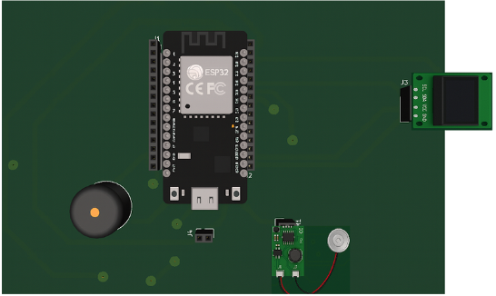

# 🏥 Proyecto: Nebulizador Inteligente (IMT-222)

> *Materia:* IMT-222 Sistemas Embebidos I  
> *Docente:* Ing. Alan Cornejo  
> *Semestre/Gestión:* [ II-2025]

---

## 📋 Descripción del Proyecto

Este repositorio aloja el código fuente y documentación técnica del proyecto *Nebulizador Ultrasonico, desarrollado como trabajo final para la materia de **Sistemas Embebidos I*.

## 👥 Integrantes del Equipo

| Nombre Completo | Registro / ID | Rol (Opcional) |
| :--- | :--- | :--- |
| *Jose Antonio Fernandez Espindola* | 10655155 | Lider de grupo |
| *Nataly Sami Romero Janco* | 10740437 | Lider de grupo |
| *Aline Geraldy Vides Peñaloza * | 10213123 | Lider de grupo  |

---

## 🎯 Objetivos

* *Implementación de Control:* Diseñar un algoritmo eficiente para el control de tiempos y dosificación del nebulizador.
* *Interfaz de Usuario:* Visualización de estados mediante [OLED].
* *Aplicación Biomédica:* Cumplimiento de estándares básicos de seguridad y operatividad para nebulizadores ultrasonicos.
* *Diseño:* Diseño de piezas en solid works para el montaje y presentación.

---

## 🛠 Especificaciones Técnicas

### Hardware
* *Microcontrolador:*  ESP32 
* *Actuadores:* Ej: Ventidor DC, Módulo Nebulizador Piezoeléctrico, pantalla OLED.
* *Alimentación:* Fuente DC 6V - 1.5A

### Software y Herramientas
* *Lenguaje de Programación:* C++ 
* *IDE:* Arduino IDE 
* *Diseño de Circuitos:* Proteus / KiCad 

---

## 📸 Galería / Esquemáticos

---

## 📄 Licencia

Este proyecto se distribuye bajo fines académicos.